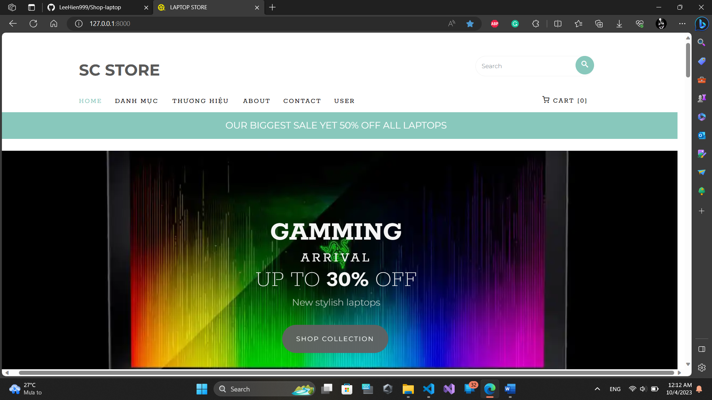
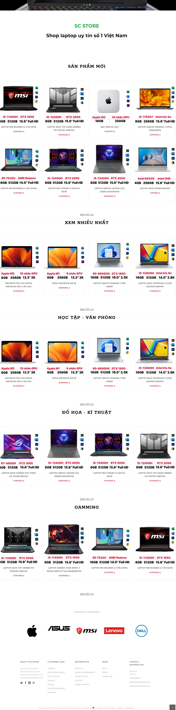
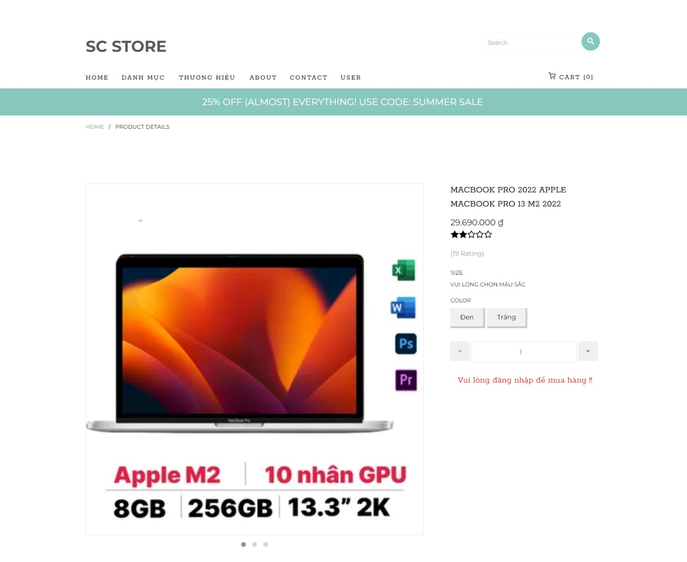
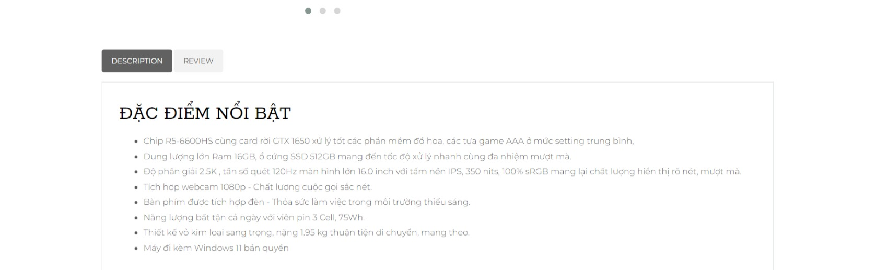
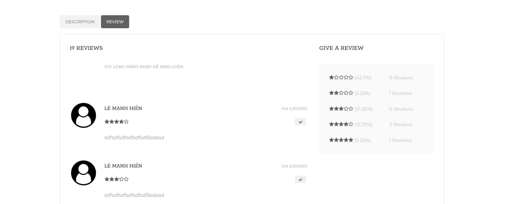
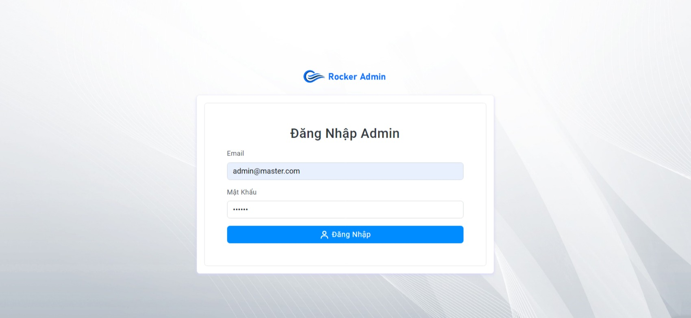
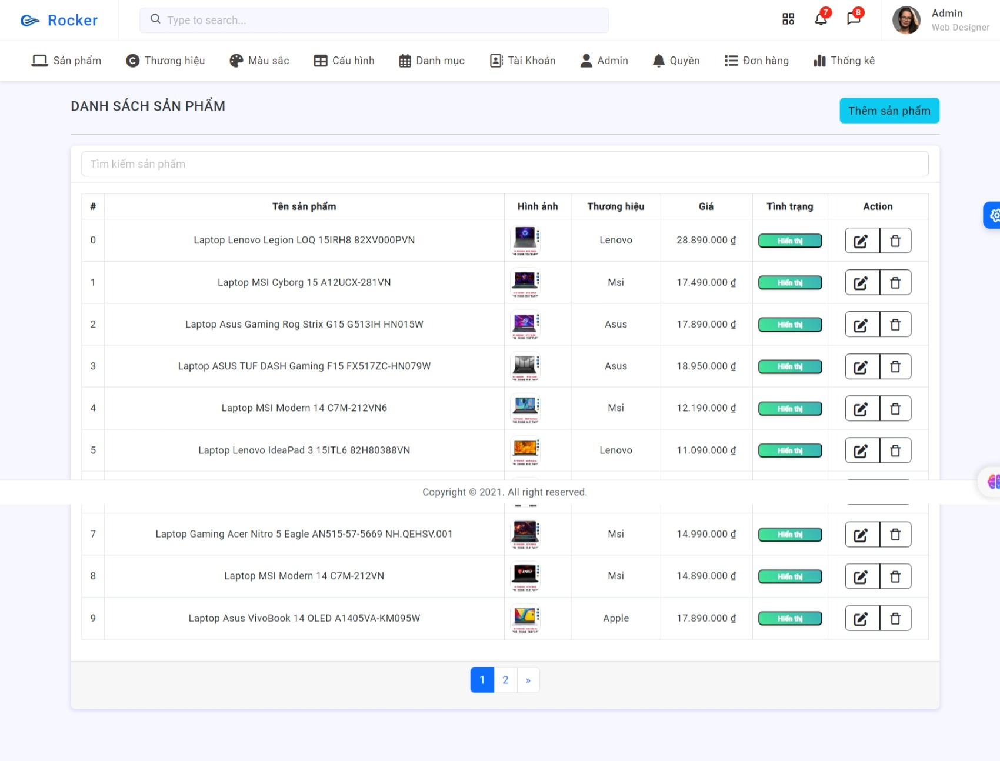

# ShopLapTopProject

ShopLapTop Project is a web application built using the PHP Laravel framework. It allows users to create, edit and delete articles on a sales website.

## Setting
To install and run `ShopLapTop` Project, you need the following requirements:

- ```PHP >= 7.3```

- ```Composer```

- ```PHPMyAdmin```

Then you can follow these steps:

- Clone project from GitHub:
```
git clone https://github.com/LeeHien999/Shop-laptop.git
```
- Move into project folder:
```
cd Shop-laptop
```
- Install dependent packages:
```
composer install
```
- Copy the .env.example file to .env and fill in the necessary information about the database and application
- Run migrations to create database tables:
```
php artisan migrate
```
- Run seeders to add data to the database:
```
php artisan db:seed
```

- Run the application server:
```
php artisan serve
```
- Open the browser and access the address:
```
http://127.0.0.1:8000/
```
## Instructions for using the email sending function
- To use the function of sending activation email or password to the registered account, you need to have a Gmail account and enable 2-layer security mode to get the key. You can follow the instructions here.
- After having a Gmail account, you need to edit mail-related information in the .env file as follows:
```
MAIL_MAILER=smtp
MAIL_HOST=smtp.gmail.com
MAIL_PORT=587
MAIL_USERNAME="yourmail@gmail.com"
MAIL_PASSWORD=yourkey
MAIL_ENCRYPTION=tls
MAIL_FROM_ADDRESS="yourmail@gmail.com"
MAIL_FROM_NAME="${APP_NAME}"
```
- You replace `yourmail@gmail.com` and `yourkey` with your email and key.
- You restart the virtual server with the `php artisan serve` command
- You can now use the email sending function when registering, forgetting your password, or changing passwords for accounts.

## Use
Project has the following features:
- Register and login with email authentication;
### ADMIN
- CRUD products.
- CRUD category.
- CRUD brand.
- CRUD configuration.
- CRUD color.
- CRUD account, permissions, decentralization, admin account.
- statistics
### ClIENT
- CRUD Orders, cart.
- Payment orders.
- view product details.
- comment

## Demo
- You can preview the web demo at the link below
- https://demoshoplaptop.dzloye.com/
- https://demoshoplaptop.dzloye.com/admin/login
- some demo images
  

  
  


  

  
  


  


  

  
  

  
## License
Some key points of the license are:

- You have the right to use, copy, modify and distribute the project for any purpose
- You are not responsible for any damages caused by using the project
Contact Info\
If you have any questions or suggestions about Laravel Project, you can contact me via:

- Email: hienlemanh2002@gmail.com
- Facebook: [https://www.facebook.com/profile.php?id=100013412708743]
## Thank you for your interest in ShopLaptop Project! 😊
